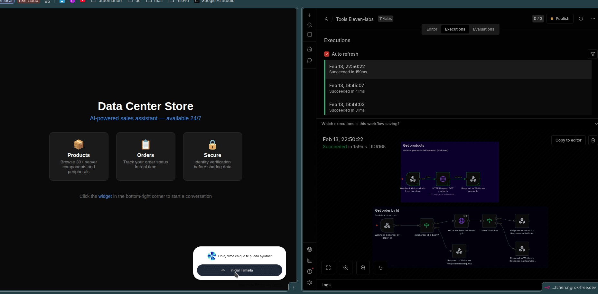
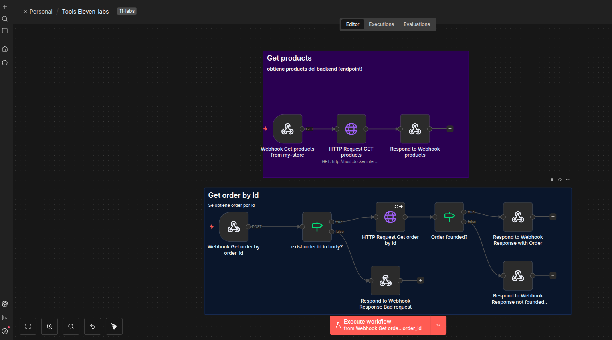

# AI Voice Sales Agent — Data Center Hardware & Peripherals

An AI-powered voice assistant built for data center hardware distributors. It handles inbound sales calls for server components, rack accessories, networking gear, and peripherals — automating product recommendations, order tracking, and technical consultations 24/7.




## Problem

Data center hardware distributors handle **high-volume, repetitive inquiries** — RAM compatibility, rack unit availability, cable specs, bulk pricing. Sales reps spend 60%+ of their time answering the same questions instead of closing deals.

This solution provides an always-available AI voice agent that:

- Recommends server components based on workload requirements (compute, storage, networking)
- Checks real-time inventory for rack accessories, SSDs, NICs, cables, and peripherals
- Tracks bulk orders by ID with identity verification
- Handles technical specs questions (form factor, compatibility, power consumption)
- Frees up sales reps to focus on high-value enterprise deals

## Architecture

```
Customer Call
      |
      v
ElevenLabs (Voice AI)
      |
      v
n8n Workflow (Orchestrator)
      |
      +---> GET /products  --> Product catalog (30 items)
      |
      +---> POST /orders   --> Order lookup by ID
                |
                +--> Order exists? --> Return order details
                |
                +--> Not found?   --> Return 404 error
```

### Workflow Detail



```
Webhook (POST /orders)
    |
    v
Validate orderId exists in body?
    |
    +-- YES --> HTTP Request GET /orders/{orderId}
    |               |
    |               v
    |          Order found?
    |               |
    |               +-- YES --> Respond with order data (200)
    |               |
    |               +-- NO  --> Respond "order not found" (404)
    |
    +-- NO  --> Respond "orderId required" (400)
```

## Key Metrics

| Metric | Before | After |
|--------|--------|-------|
| Response time | 2-5 min (sales rep) | < 3 sec |
| Availability | Business hours only | 24/7 (nights, weekends, holidays) |
| Cost per interaction | $1-3 (human agent) | $0.02 (API calls) |
| Product accuracy | Varies by rep knowledge | 100% (real-time inventory) |
| Sales rep time on routine queries | 60%+ | 0% (handled by AI) |

## Tech Stack

| Component | Technology | Purpose |
|-----------|-----------|---------|
| Voice AI | ElevenLabs Conversational AI | Natural voice interactions |
| Orchestrator | n8n (self-hosted) | Workflow automation, API routing |
| Backend API | json-server (Node.js) | Product catalog + order management (swappable for any REST API) |
| Tunnel | ngrok | Expose local services to ElevenLabs |
| Auth | Header-based API key | Secure webhook endpoints |

> **Note:** The json-server backend is a demo layer. In production, swap it for any REST API (WooCommerce, Shopify, SAP, custom ERP) — the n8n workflow stays the same.

## Security Features

- API key authentication on all webhook endpoints
- Customer identity verification (name + order ID) before sharing order data
- Phone number fallback verification if name doesn't match
- No sensitive data exposure (internal emails, payment details)
- Prompt injection protection (agent ignores behavior override attempts)

## Quick Start

### Prerequisites

- Node.js v18+
- n8n instance (self-hosted or cloud)
- ElevenLabs account with Conversational AI
- ngrok account (free tier works)

### 1. Install dependencies

```bash
cd my-store
npm install
```

### 2. Configure environment

```bash
cp .env.example .env
# Edit .env with your API keys
```

### 3. Start the backend

```bash
npm start
# API running at http://localhost:3000
```

### 4. Expose with ngrok

```bash
ngrok http 5678
# Use the public URL in ElevenLabs agent config
```

### 5. Import n8n workflow

Import `workflows/n8n-workflow-ai-agent-tool-elevenlabs.json` into your n8n instance.

## API Endpoints

| Method | Endpoint | Description | Auth |
|--------|----------|-------------|------|
| GET | `/products` | List all products (30 items) | No |
| GET | `/orders` | List all orders (20 items) | No |
| GET | `/orders/:id` | Get specific order | No |
| POST | `/webhook/my-store/products` | n8n webhook - product query | API key |
| POST | `/webhook/my-store/orders` | n8n webhook - order lookup | API key |

## Troubleshooting

See [docs/troubleshooting.md](docs/troubleshooting.md) for detailed debugging guides.

| Issue | Cause | Fix |
|-------|-------|-----|
| Widget not loading | Brave blocks WebGL | Use Chromium or Chrome |
| `Authorization data is wrong!` | ngrok pointing to wrong port | Restart: `ngrok http 5678` |
| Webhook returns 401 | Missing or wrong API key | Check `x-api-key` header matches `.env` |
| Order not found (false negative) | orderId format mismatch | Use format `XXXX-YYYY` (e.g., `1001-2024`) |
| n8n can't reach json-server | Docker network issue | Use `http://host.docker.internal:3000` |
| ElevenLabs no response | ngrok tunnel expired | Restart ngrok, update URL in ElevenLabs |

## Project Structure

```text
my-store/
├── .env.example          # Environment template (API keys)
├── .gitignore            # Ignored files (secrets, node_modules)
├── package.json          # Node.js dependencies
├── README.md             # This file
├── db.json               # Demo product/order data (json-server)
├── index-agent.html      # ElevenLabs agent widget (landing page)
├── LICENSE               # MIT
├── docs/
│   ├── troubleshooting.md                          # Debugging guide
│   ├── voice-agent-demo.gif                        # Live demo recording
│   ├── widget-landing-page.png                     # Landing page screenshot
│   ├── widget-n8n-workflow-demo.png                # Full demo screenshot
│   ├── postman-order-flow.png                      # Order API test
│   └── n8n-workflow-ai-agent-tool-elevenlabs.png   # Workflow diagram
├── system-prompt/
│   └── system-prompt.md  # AI agent behavior rules
└── workflows/
    └── n8n-workflow-ai-agent-tool-elevenlabs.json  # n8n workflow (importable)
```

## License

MIT

